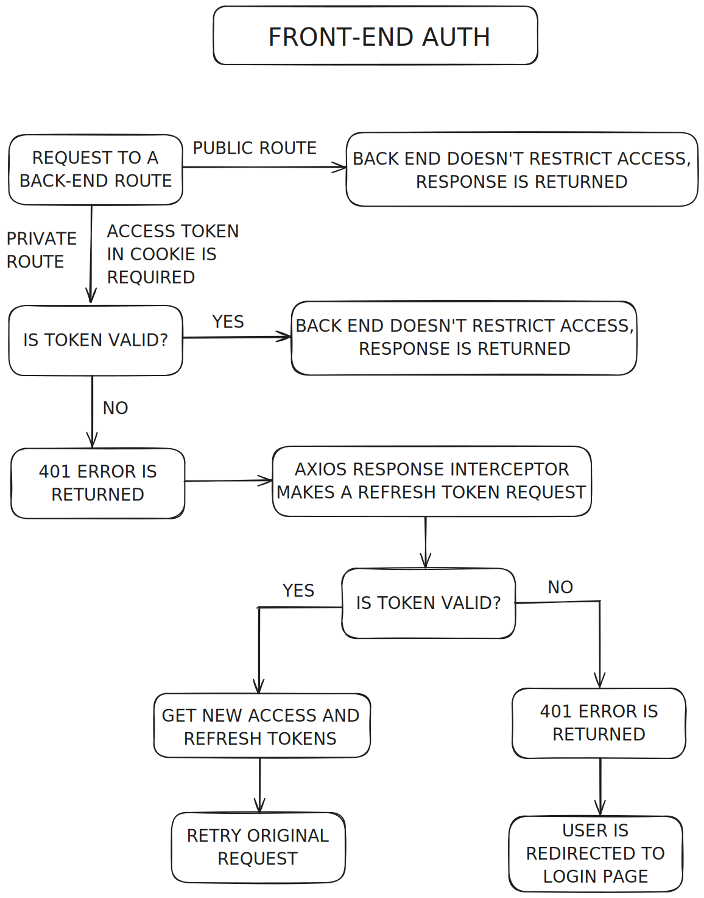
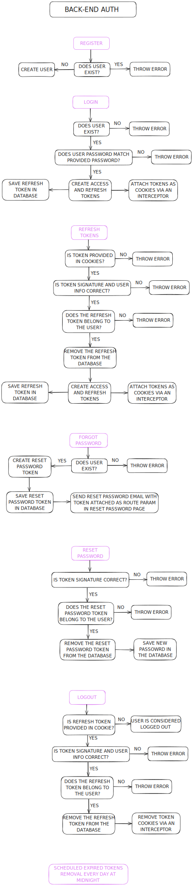

# 💡 **Qintronics Electronics Store - Full-Stack**

## 🛠️ **Features**

In addition to the essential features shared with the Vanilla JS implementation, this full-stack version offers enhanced functionalities for managing products and orders:

- 🔄 **Compare Products** – Evaluate items side by side for better decision-making.
- 🤖 **Chatbot Assistance** – Search for products with the help of a chatbot.
- ⏱️ **Real-Time Order Tracking** – Stay updated on your order’s status.
- 📧 **Email Notifications** – Receive order confirmations and cancellations directly in your inbox.

### 🔐 **Authentication and Security**

- 📝 **User Registration, Login, and Logout** – Smooth account management.
- 🔑 **Secure JWT Authentication** – Ensuring safety and reliability using **JSON Web Tokens**.
- 🍪 **Cookie-Based Token Storage** – Preventing token manipulation from the front end.
- 🔄 **Password Reset** – Reset forgotten passwords via email using JWT for secure access.

### 🔓 **Authorization and Roles**

Three user roles are enabled with specific permissions:

#### 👩‍💼 **Admin**

- 🔧 Manage products, sections, and categories with full CRUD capabilities.
- 👥 Change user roles.
- 📊 View all registered orders and analytics like:
  - 💰 Total Sales
  - 🛒 Orders
  - 👤 Users
  - 📈 Average Order Value
- 📅 Analyze orders by month using dynamic charts.
- ❌ Cancel orders and delete users if necessary.

#### 🚚 **Delivery Person**

- ✅ Mark orders as **taken** or **delivered**.

#### 🛍️ **Customer**

- 🛒 Place orders and pay with cash or card (option to save card details).
- ❌ Cancel orders before they are marked as taken.
- 📜 View order history.
- ✏️ Update profile information.

---

## 📦 **Database**

The database relationships are structured as shown in the following ER diagram:

---

## 👩‍💻 **My Contributions**

For this implementation, our group divided tasks between front-end and back-end teams. I focused primarily on back-end tasks while assisting with front-end logic and debugging. My key responsibility was developing the entire **authentication and authorization flow** from end to end, along with managing user-related functionality.

### 🛠️ **Front-End Authentication Flow**

The front-end flow is fully automated with **Axios interceptors** to manage requests and responses with no friction:

### ⚙️ **Back-End Authentication Architecture**

The back-end leverages:

- A **JWT Guard** that triggers a **JWT Strategy** to validate tokens.
- Custom interceptors for managing cookies containing the access and refresh tokens.
- A tailored guard for handling authorization logic.

Here’s the back-end flow for authentication:

---

## 🚀 **How to Run the Project**

1. Clone the repository.
2. Navigate to the client and server directories and install dependencies using **npm install**.
3. Start the client and server:
   - Client: **npm run dev** (React app).
   - Server: **npm run start:dev** (NestJS app).
4. Initialize the database with Swagger APIs:
   - **/api/users/init-users**
   - **/api/sections/backfill**
5. Open the application in your browser.
