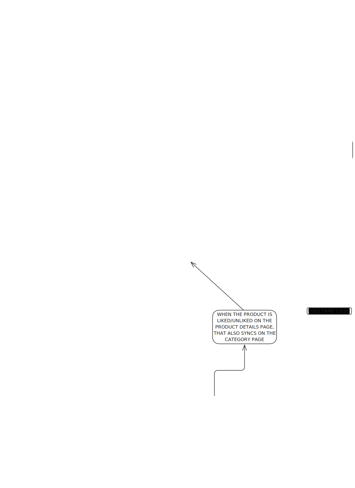

## 👩‍💻 **My Contributions**

As part of the team working on the **Vanilla JS Implementation**, I contributed to the design and functionality of the **Category Page** and **Product Details Page**, following an **OOP approach** and utilizing **ES modules**. The **category product cards** I created are designed to be reusable throughout the application, appearing in other sections like the **Sales Page**, **Favourites Page**, and **Search Page**.

### 🛠️ **Category Page: Tasks and Features**

I tackled several unique challenges to establish a smooth workflow for the **Category Page**:

- 📂 **Dynamic Sidebar Integration**: Handle communication with the sidebar to fetch the chosen (sub)category of products.
- ❤️ **Favourites Tracking**: Indicate if a product is already added to favourites.
- 📊 **Flexible Product Listings**: Support different numbers of products per page.
- 🧮 **Sorting Options**: Enable sorting products by criteria like price or alphabetical order.
- 🔢 **Pagination**: Implement pagination for easy navigation between product listings.

### 🔍 **Product Details Page: Tasks and Features**

For the **Product Details Page**, my focus was on enhancing user interactivity and synchronization across pages:

- 📋 **Product-Specific Rendering**: Fetch and display details of the selected product.
- 🔄 **Like Sync Across Pages**: Ensure likes/unlikes are reflected across other pages (e.g., **Category Page**, **Search Page**, etc.) for the same product. _(Reverse sync is not enabled, as it’s less likely to be required.)_

### 🔗 **Common Features Across Pages**

Both pages share several essential e-commerce functionalities:

- 🧭 **Breadcrumb Navigation**: Create a dynamic breadcrumb.
- ❤️ **Like/Unlike Functionality**: Provide real-time updates for the **Favourites Page** and the **header badge**.
- 🛒 **Add to Cart**: Enable cart functionality, with updates reflected in the **Cart Page** and **header badge**.

---

### 🎨 **Visual Aid**

To better illustrate the flow of tasks and solutions, I created a **Flow Diagram**:

